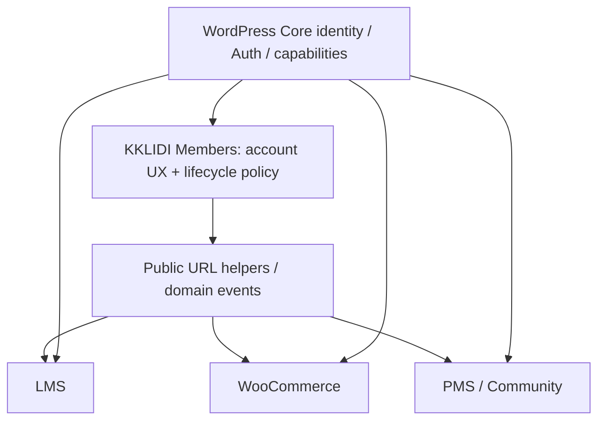

# Architecture · Data · Public Contract

이 문서는 모듈·데이터·외부 계약의 기준이다. Evidence E01~E17은 PRODUCT §2를 참조한다. 아래 schema는 논리 설계이며 DDL이나 runtime이 아니다.

## 1. Naming과 경계

| 항목 | 확정 convention |
| --- | --- |
| Plugin name / slug / text domain | `kklidi-members` |
| PHP namespace | `KKLIDI\Members` |
| 함수 | `kklidi_members_` |
| 상수 | `KKLIDI_MEMBERS_*` |
| REST namespace | `kklidi-members/v1` (예약; 1.0에 REST 인증 엔진을 추가하지 않음) |
| Custom table logical prefix | `kklidi_mem_` |
| 테이블 이름 계산 | `$wpdb->prefix . 'kklidi_mem_login_audit'` 등 |
| 신규 usermeta / option | `_kklidi_members_*` / `kklidi_members_*` |

users/usermeta 접근은 WordPress API 또는 `$wpdb->users`, `$wpdb->usermeta`로 한다. `wp_users`/`wp_usermeta`는 논리 설명이며 prefix hardcode가 아니다. 현지 E01 prefix는 `wp_`, E11 LMS는 `$wpdb->prefix . 'kklidi_lms_'`다. 로컬 payout의 관찰된 prefix는 `kklidi_pos_`이고 요청에서 언급한 `kklidi_pms_`는 이 snapshot에서 확인되지 않았다. 이를 수정하거나 신규 naming을 변경하지 않는다.

Members 내부 Repository나 Service class를 다른 플러그인의 import 대상으로 만들지 않는다. 인증 판단은 `is_user_logged_in()`, `get_current_user_id()`, `current_user_can()`이다. LMS 수강권은 LMS가, Woo 주문 권한은 Woo가 판단한다.

## 2. 기존 데이터 audit와 처리 분류

2026-09-06 read-only 집계. populated는 trim 후 비어 있지 않은 값이며 진위·동의 유효성·검증 완료를 뜻하지 않는다. 행 단위 개인정보는 저장하지 않았다.

| 원천 필드/데이터 | 관찰값 (명 또는 행) | 분류 | 향후 처리 |
| --- | --- | --- | --- |
| WordPress users.ID | 434명 | KEEP | 모든 서비스 ID 유지, 새 identity 매핑 없음 |
| user_email | 434명, 대소문자 무시 중복 그룹 0 | KEEP | 계정 이메일. billing_email과 구분 |
| user_login | 397명 email과 동일, 37명 다름 | KEEP | 변경·재발급하지 않음; 양쪽 로그인 지원 |
| user_pass | 값/해시를 조회하지 않음 | KEEP | Core hashing 유지; migration 명목 재해시 금지 |
| display_name / nickname | 각각 434명 | KEEP | 표시명과 nickname이 같은 값인지 전수 판정하지 않음; UI는 display_name 기준 |
| first_name / last_name | 433 / 10명 | KEEP | 이름을 임의로 분할·병합하지 않음 |
| description | 434행, populated 0 | LEGACY_KEEP | LMS 기존 editor fallback, 신규 UI 선택 |
| billing_phone | 434행, populated 427명 | KEEP | 1.0 account phone의 호환 저장 key로 사용; 인증 상태와 분리 |
| phone_number | 6명, 모두 billing_phone 존재; 구분자 제거 후 5명 일치/1명 상이 | LEGACY_KEEP | 자동 우선순위 병합 금지. 충돌 1건은 후속 관리자 확인 |
| phone1 | 전체 meta-key 집계에서 없음 | UNKNOWN | Cosmosfarm checkout default reader만 존재. billing_phone을 덮어쓰는 근거로 사용 금지 |
| billing_email / billing_first_name / billing_last_name | populated 361 / 360 / 2명 | KEEP | Woo 소유. 계정 이메일/이름 변경으로 기존 billing·주문 수정 금지 |
| billing_who | 319명 | UNKNOWN | 사업 용도·writer/reader 추가 확인; UI나 새 phone으로 통합 금지 |
| billing/shipping 주소·국가·회사 | 조사한 billing 52행씩, populated 0; shipping 계열도 대부분 52행 빈값 | LEGACY_KEEP | Woo가 소유; Members 제거 대상 아님 |
| policy_service / policy_privacy | 각 398행 = agree 386 + 빈값 12; 36명은 row 없음 | MIGRATE | 명시적 legacy import 시 agree만 과거 상태 증거로 보존. 약관 버전·동의 시각은 unknown |
| tos | 52행 전부 빈값 | REMOVE_LATER | default WP-Members 필드 잔재. 참조 제거 검증 후 별도 cleanup |
| 마케팅 동의 | 등록 필드 없음; marketing/consent/agree 검색에서 명시적 회원별 증거 미발견 | UNKNOWN | 전원 미동의로 단정하지 않고 legacy_unknown. 신규 opt-in은 기본 미선택 |
| Cosmosfarm 사용자 meta | 해당 namespace의 실회원 meta 미발견 | UNKNOWN | 기능 존재로 data migration을 만들지 않음 |
| _wpmem_user_confirmed / _wpmem_activation_confirm | 각 1명 | LEGACY_KEEP | 현행 act_link=0; 이메일 검증으로 승격 금지, token성 원문 복사 금지 |
| username meta | 386명 | REMOVE_LATER | Core user_login과 별개 잔재. fallback reader 제거 후 삭제 검토 |
| wpmem_reg_ip / wpmem_reg_url | 433 / 386명 | LEGACY_KEEP | 개인정보·기록 용도. 새 audit로 전량 복사하지 않음 |
| user_lastlogin / learndash-last-login / wfls-last-login / st_last_login | 434 / 434 / 429 / 97명 | LEGACY_KEEP | 소유 플러그인·retention 확인; 하나의 verified 상태로 합치지 않음 |
| session_tokens / capabilities / user_level | Core meta 관찰 | KEEP | WP API 관리, role·cookie·session token 이식 없음 |
| _kklidi_lms_verified_name* | 1명 | KEEP | LMS verified name/방법/시각 소유; phone/email 인증과 무관 |
| Cosmosfarm login_history | 8,707행: 성공 7,755, 실패 952 | LEGACY_KEEP | 기존 테이블 유지; 신규 로그만 새 audit로 기록 |
| Cosmosfarm activity/certification history | 각각 0행 | REMOVE_LATER | 전환 검증·보존 검토 뒤 제거 여부 판단 |
| Woo HPOS orders | 615행 = shop_order 611 + refund 4 | KEEP | Woo CRUD로만 접근; 주문 이전 없음 |
| LMS enrollments / progress / certificates | 233 / 44 / 4행 | KEEP | user_id 양수 참조 orphan 0; enrollment ID도 유지 |
| LMS private_questions | 3행 | KEEP | student/instructor/last actor 등 WP ID 유지; 이번 audit은 전체 actor join 검증까지 아님 |
| LMS activity | 1,306행, anonymous user_id=0 252행, 양수 ID orphan 0 | KEEP | 익명 활동을 누락 회원으로 오판하지 않음 |
| KBoard content | 412행 모두 member_uid > 0 | KEEP | Core ID 유지; 전체 orphan 검사·댓글 actor 검사는 후속 harness |

과거 login history의 성공 이벤트에는 distinct user_id 505개가 있어 현재 434명보다 많다. 과거 삭제·이관의 결과일 수 있으며 원인은 UNKNOWN이다. 로그의 날짜 범위는 저장값일 뿐 timezone 검증 전 타임라인 근거로 사용하지 않는다. 오래된 사용자 ID를 되살리거나 현재 계정에 재배정하지 않는다.

## 3. 모듈 구조와 load 규칙

| 모듈 | 책임 | 1.0 / 로딩 조건 |
| --- | --- | --- |
| Core | version/config, lazy factory, URL facade, 필수 lifecycle guards | 필수, 최소 bootstrap |
| Auth | Core signon/logout wrapper, 계정 상태 및 limiter policy | 인증 경로에서 service load; 필수 auth guard hook 등록은 전역 허용 |
| Registration | fixed fields, server role, duplicate/consent validation | 가입 GET/POST만 |
| Password | Core lost/reset, 현재 비밀번호 확인 후 변경 | password route만 |
| Profile | self profile field allowlist, phone validation | profile route만 |
| Consent | 문서 version·hash·append-only 동의 사건 | 가입/동의 화면·변경 처리만 |
| EmailVerification | token 발급/소비, 상태·resend | 선택, enabled + 해당 route만 |
| TwoFactor | password 후 challenge, recovery | FUTURE, disabled면 class/provider 미로드 |
| Social | provider registry·callback·link/unlink | FUTURE, provider별 route에서만 |
| Withdrawal | 본인 요청·상태 전이·세션 철회·domain 처리 조정 | 필수, 요청/관리 작업에 한정 |
| Audit | 성공/실패/민감 변경의 최소 event | 해당 hook 발생 시 repository load |
| Frontend | server-rendered form, 오류·접근성, assets | 등록된 account 화면/실제 component 렌더 시만 |
| Admin | page/필드 설정, audit·탈퇴 queue 권한 UI | 관리자 화면에 한정; frontend 객체 초기화 금지 |
| Integrations/WooCommerce | account link, 호환 phone adapter, lifecycle 협의 | Woo 존재 + 관련 route/event일 때 |
| Integrations/KKLIDILMS | 공통 URL·변경 event의 선택적 이용 안내 | 큰 LMS 객체 생성 금지; LMS data/query 소유 안 함 |
| Integrations/Community | Core identity·공통 UX 연결 경계 | FUTURE; KBoard 권한 엔진 복제 없음 |

제안 구성은 entry file → Core bootstrap/facade → 선택 module → view/assets다. Phase 0에는 이 디렉터리/파일을 생성하지 않는다. 모든 파일을 require하거나 provider SDK를 미리 load하는 registry는 금지한다.

일반 GET은 static route 판정·URL/auth guard 등록만 한다. Admin hook callback 등록과 Admin 객체 생성은 구분한다. 활성화/migration/cron 예약을 일반 init에서 반복 실행하지 않는다. CSS/JS는 page ID 사전 판정 또는 명시적 component 렌더 신호로 enqueue하며 shortcode 문자열 하나만 검사해 widget/block 삽입을 놓치지 않는다. 동적 삽입은 해당 요청에서만 필요한 자산을 제공한다. 인증·계정 화면은 cache bypass, no-store로 개인정보와 nonce 공유 캐시를 막는다.

## 4. 상태성 usermeta와 호환 phone

| 제안 key | 의미 | 쓰기 권한 |
| --- | --- | --- |
| `_kklidi_members_account_state` | active / registration_pending / withdrawal_pending / disabled | lifecycle service만 |
| `_kklidi_members_email_state` | legacy_unknown / pending / verified | verification service만; 클라이언트 verified 입력 거부 |
| `_kklidi_members_verified_email_digest`, `_kklidi_members_email_verified_at` | 검증된 정규화 이메일에 대한 keyed digest와 UTC 시각 | 이메일 binding 변경 시 무효화 |
| `_kklidi_members_withdrawal_requested_at`, `_kklidi_members_withdrawal_request_id` | 최신 탈퇴 요청 상태·idempotency | 본인 재인증 + lifecycle service |
| `_kklidi_members_phone_verified_at` | FUTURE, 소유 확인 완료 시간 | 전화 변경 시 clear; 기존 billing_phone에서 소급 생성 금지 |

meta 없는 기존 회원은 active + legacy_unknown으로 해석한다. 이것은 검증 성공 부여가 아니다. 인증서 verified name과 혼용하지 않는다. 캐시 값은 source of truth가 아니며 보호 상태 변경 시 user cache를 무효화한다.

1.0은 계정 전화 저장을 `billing_phone`에 유지하여 불필요한 meta migration을 없앤다. Woo 활성 시 WC_Customer API를 통한 adapter, 비활성 시 WordPress meta API를 사용한다. 이 명시적 self phone 수정만 Woo customer 연락처에 반영하며 **과거 주문 phone은 변경하지 않는다**. 다른 billing 값은 동기화하지 않는다. `phone_number`는 자동 fallback/복사하지 않고 관리자 검토 대상으로 남긴다. 향후 독립 account phone 요구가 확정되면 별도 versioned migration을 설계한다.

새 계정은 이메일 중심 UI + 충돌 없는 비공개 user_login 후보를 WP API로 생성하는 방안을 권장한다. user_login을 공개 닉네임이나 이메일 변경의 동기화 대상으로 삼지 않는다. 이 전략은 새 계정만 대상으로 하며 기존 login string 434개는 유지한다. 한글 표시명은 text 검증, nicename은 별도 비어 있지 않은 unique slug로 처리한다.

## 5. Custom table 결정

**1.0은 login_audit와 consents의 2개만 제안한다.** verifications는 이메일 검증을 실제 넣는 버전부터, social_identities는 첫 provider 도입부터 만든다. 생성은 후속 구현·배포에서만 한다. Single-site 우선; multisite network-wide identity/linking·blog 범위는 별도 gate다.

### `{$wpdb->prefix}kklidi_mem_login_audit` — 1.0

- 이유: 사용자별 여러 로그인·실패·보안 사건과 기간별 검색. usermeta 배열은 행 증가·동시 append·보존 삭제·시간 index에 부적합하다.
- PK: `id BIGINT UNSIGNED`. `user_id BIGINT UNSIGNED NULL`은 Core ID 논리 참조; unknown identifier/삭제 후 비식별 사건은 NULL. cascade FK로 Core 사용자를 삭제하지 않는다.
- 최소 column: `occurred_at_utc`, `event_type`, `result`, `reason_code`, `request_id`, 선택적 회전 HMAC `subject_digest`, `network_digest`. 이 테이블은 이름과 달리 탈퇴 요청·승인·동의 실패 같은 최소 계정 보안 사건도 허용하며 학습 activity는 담지 않는다.
- index: PK, `(user_id, occurred_at_utc, id)`, `(event_type, occurred_at_utc)`, `(occurred_at_utc, id)`; idempotent event는 unique `(request_id, event_type)`.
- 개인정보: WP ID와 pseudonymous digest도 개인정보로 취급. 원문 이메일·IP·UA·비밀번호·reset/verification token 금지. raw request/response payload 금지.
- retention 제안: 성공 30일, 실패/보안 사건 90일, HMAC key는 기간별 회전. **운영 제안이며 법적 기간 아님**. D02 승인 전 legacy 삭제 안 함.
- 삭제/익명화: 처리 사유에 따라 user_id를 NULL로 전환하고 연결 digest 제거하거나 행 삭제. 감사 목적 법적 보존이 필요한 사건은 별도 승인 정책으로 제한 접근. batch cleanup은 scheduled job, 일반 GET에서 실행 금지.

### `{$wpdb->prefix}kklidi_mem_consents` — 1.0

- 이유: 같은 사용자에게 문서별 여러 version/동의/철회 사건이 존재한다. usermeta 단일 boolean은 그때의 문서·시각·withdrawal 기록을 설명하지 못한다.
- PK `id BIGINT UNSIGNED`, `user_id BIGINT UNSIGNED NULL` Core 논리 참조. `consent_type` (service/privacy/선택 marketing), `document_version NULL`, `document_hash NULL`, `action` (accept/withdraw/legacy_import), `occurred_at_utc NULL`, `recorded_at_utc`, `source`, `request_id`.
- document 원문/version은 관리자 승인된 immutable 문서 snapshot에 보관한다(WordPress 전용 문서 revision 또는 versioned option). hash만 있고 원문이 사라지지 않도록 snapshot 삭제 gate를 둔다. 별도 documents table은 1.0에 불필요하다.
- index: `(user_id, consent_type, id)`, `(consent_type, document_version)`, `(recorded_at_utc, id)`, unique `(request_id, consent_type, action)`.
- 과거 agree import는 `action=legacy_import`, version/hash/occurred_at=NULL, source=legacy_wpmembers, recorded_at=실제 import 시각. 현재 약관 version이나 가입일을 동의 시각으로 채우지 않는다. 12개 빈값·36개 missing은 동의 사건을 만들지 않는다.
- 개인정보: ID와 동의 이력. IP/UA는 기본 미수집. retention과 탈퇴 후 유지기간은 **USER_DECISION_REQUIRED D02**; 동의 유형별 필요성을 정한다.
- 삭제/익명화: 운영 중 의미 수정은 append event; 법적 삭제/보존 정책 실행은 예외로 행 삭제 또는 user_id 제거. 해시·문서 version만으로 재식별할 수 없다는 보장도 하지 않는다.

### `{$wpdb->prefix}kklidi_mem_verifications` — 선택/FUTURE

- 이유: 발급·재발급·소비·만료·시도 횟수를 원자적으로 갱신하는 단기 1:N challenge. usermeta 하나로 여러 목적의 경쟁 요청·one-time consumption을 제어하기 어렵다.
- PK `id BIGINT UNSIGNED`, `user_id BIGINT UNSIGNED NULL` (pre-auth challenge에서만 NULL 가능), `purpose`, unique `selector`, `token_hash`, `target_digest`, `browser_binding_hash NULL`, `expires_at_utc`, `consumed_at_utc NULL`, `revoked_at_utc NULL`, `attempts`, `created_at_utc`.
- index: unique selector, `(user_id, purpose, created_at_utc)`, `(expires_at_utc, id)`. 모든 조건 검증과 consume는 하나의 conditional write/transaction으로 처리한다. 암호화가 필요한 pending email 자체는 목적 한정 encrypted payload로만 단기 저장한다.
- 개인정보: user ID·email digest·challenge 연결값. plaintext bearer token/OTP 장기 저장 금지. TOTP seed는 이 table에 넣지 않는다.
- retention: 이메일 TTL 30분 제안, 소비/만료 payload 즉시 제거, tombstone 최대 24시간 후 정리. 시각·보존 수치는 제품 기본값 제안이며 SECURITY와 함께 변경한다.
- 탈퇴/이메일 변경/재발급은 해당 challenge revoke. 실패 횟수와 rate limiter는 별개이다. 기능 미도입 시 테이블 미생성.

### `{$wpdb->prefix}kklidi_mem_social_identities` — FUTURE

- 이유: 한 WP user에 여러 provider identity, 하나의 provider subject는 한 user에만 연결되어야 한다. 중복 usermeta 검사만으로 동시 linking 유일성을 보장할 수 없다.
- PK `id BIGINT UNSIGNED`; `user_id BIGINT UNSIGNED NOT NULL`; `provider`, `issuer`, `subject`, `identity_key`, `created_at_utc`, `last_used_at_utc`, `revoked_at_utc NULL`.
- index: unique `identity_key` (길이 구분한 provider+issuer+subject의 SHA-256 binary digest); 원본 tuple을 binary/case-sensitive 비교하여 digest 충돌 시 거부. `(user_id, provider)` 일반 index, `(revoked_at_utc, id)` cleanup index. 이메일은 unique identity key가 아니다.
- 개인정보: provider subject와 WP 연결 자체. 액세스/refresh token은 로그인만 필요하면 저장하지 않으며 revoke API가 요구하면 encrypted 최소 단기 저장을 별도 심사한다.
- retention: 연결 유지 동안 보관; unlink 시 즉시 로그인 사용 중지, provider revoke 시도 후 mapping 삭제 또는 승인된 짧은 tombstone. 감사에는 최소 사건만 남긴다. 탈퇴 후 장기 기간 D02 결정.
- 신규 사용자 생성과 link 획득은 경쟁 요청에서 user 중복·고아 계정이 생기지 않도록 identity lock/idempotency와 실패 복구를 함께 설계한다.

### 원자적 보안 저장소

1.0 rate limit은 audit table COUNT나 비원자 transient 증가로 구현하지 않는다. 우선 원자 증가·만료가 검증된 persistent cache adapter를 사용한다. 없으면 기존 WordPress options의 unique option_name을 이용한 bounded counter/CAS adapter(autoload=false, expires 포함, scheduled cleanup)를 제공한다. 인증 요청에서만 사용하고 일반 GET에서는 조회하지 않는다. DB fallback의 claim/증가/TTL 경쟁과 장애를 harness에서 검증한다. 범용 cache 장애로 무제한 허용하면 안 된다.

동일 이메일 가입은 DB collation에 맞춘 정규화 lock + 내부 중복 재검사 + wp_insert_user + idempotency로 직렬화한다. Core users.user_email이 DB UNIQUE라고 가정하지 않는다. custom consent append 실패 시 계정은 registration_pending으로 남겨 로그인·권한 사용을 막고 재시도로 완성한다. WP hook/메일까지 DB transaction으로 rollback된다고 가정하지 않으며, 비밀번호 저장·역할 부여·동의·알림의 부분 실패 보상을 별도로 검증한다. 실제 외부 알림은 최종 상태 확정 후 수행한다.

## 6. 최소 public contract (제안, 구현 전 고정 대상)

| 함수 계약 | 반환과 동작 | 미활성 시 consumer fallback |
| --- | --- | --- |
| `kklidi_members_login_url(string $redirect_to = ''): string` | 검증한 목적지를 포함한 로그인 URL | `wp_login_url($redirect_to)` |
| `kklidi_members_register_url(string $redirect_to = ''): string` | 가입 URL. disabled 상태는 화면에서 안내하며 URL 호출로 활성화 안 함 | `wp_registration_url()`; Core 가입 금지 존중 |
| `kklidi_members_account_url(): string` | 공통 account landing | Woo 사용 가능 시 My Account, 아니면 Core profile URL |
| `kklidi_members_profile_url(): string` | 현재 사용자 profile 화면 | Core `get_edit_profile_url()` 또는 기존 LMS profile |
| `kklidi_members_password_reset_url(string $redirect_to = ''): string` | 분실/reset 시작 URL; token을 인자로 노출 안 함 | `wp_lostpassword_url($redirect_to)` |
| `kklidi_members_safe_redirect_url(string $candidate, string $fallback = ''): string` | side effect 없는 검증된 local URL; fallback도 검증, 최종 home | Core safe validation + safe redirect |

Consumer는 `function_exists()`로 helper 사용 여부를 결정한다. Members helper가 자신의 login_url filter를 다시 부르는 순환을 만들지 않는다. Core login/register/lostpassword URL filter는 전환 소유권이 Members인 경우에만 적용하고, wp-admin 재인증과 Core fallback 경로를 유지한다. 기존 WCI checkout redirect의 소유자는 WCI로 유지한다.

redirect helper는 host만 같은지를 넘어 scheme·port·userinfo·CRLF·protocol-relative·backslash·중첩 redirect·auth route loop를 검사한다. 최종 이동은 `wp_safe_redirect()` 후 exit. home/base path/subdirectory 배치를 고려하고, 전달한 목적지가 허용되어도 목적지 resource 권한은 별도 확인한다.

새 notification action은 필요할 때만 `kklidi_members_profile_updated($user_id, $changed_field_names)`, `kklidi_members_email_verified($user_id)`, `kklidi_members_account_state_changed($user_id, $old, $new, $event_id)`로 제한한다. raw PII/token을 event payload에 담지 않고 성공 후 1회 발행, retry consumer는 event_id로 중복 처리 방지. 동의 변경의 소유자는 Consent이며 통합 플러그인이 동의 테이블을 직접 수정하지 않는다.

1.0은 server-rendered form POST를 기본으로 한다. REST namespace를 예약했다고 로그인 JWT·public user listing·임의 user_id profile endpoint를 만들지 않는다. 추후 `/me`는 Core cookie+REST nonce+현재 사용자 scope, 관리자 기능은 별도 capability로 제한한다.

Members 비활성 fallback은 **fatal 없음과 Core identity 지속**을 뜻한다. Members만 가진 disabled/2FA 정책이 비활성 후 자동으로 계속 집행된다는 뜻은 아니다. 탈퇴 차단 계정이나 2FA 계정이 생긴 이후 비활성화하려면 동등 정책을 담당할 서비스와 회귀 검증이 먼저 필요하다(SECURITY/MIGRATION).
